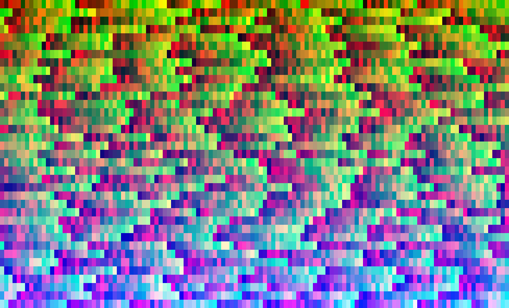

# Colours

An "random & sort" algorithm to spit out RGB values in an artistic way.




## Make it run

[install Rust](https://www.rust-lang.org/tools/install).
[Learn it](https://doc.rust-lang.org/book/).
Thank me later.

Clone the repository and run with cargo:

```sh
git clone https://github.com/Keksoj/colours.git
cd colours
cargo run
```

---

## Wait, what does it do exactly?

> “All art is quite useless.”  
    - Ocar Wilde

It was first a training exercise to implement quicksort in rust.
Then I got the idea of [displaying quicksort with colours](https://github.com/Keksoj/sorting-colours).
Then I thought: why not do something arty with it?

Here is what the program does:

-   Compute how much characters (and thus, colour units) can fit in the terminal
-   Find just this many random integers of the range [0, 0xFFFFFF]
-   Sort this list of integers with quicksort
-   Display each integer with a colour, that's were it gets tricky and useless:
    1. split the u32 integer into 4 bytes (little endian).
    2. The first byte will code for the colour red, the second for green, the third for blue
    3. Give those three values to termion, Rust's terminal displayer, as RGB
    4. Steal my code, do a performance with it, make yourself a name at MoMa.
    5. Profit.


## Why the british spelling though?

French school students learn british english. Plus, it's edgy.